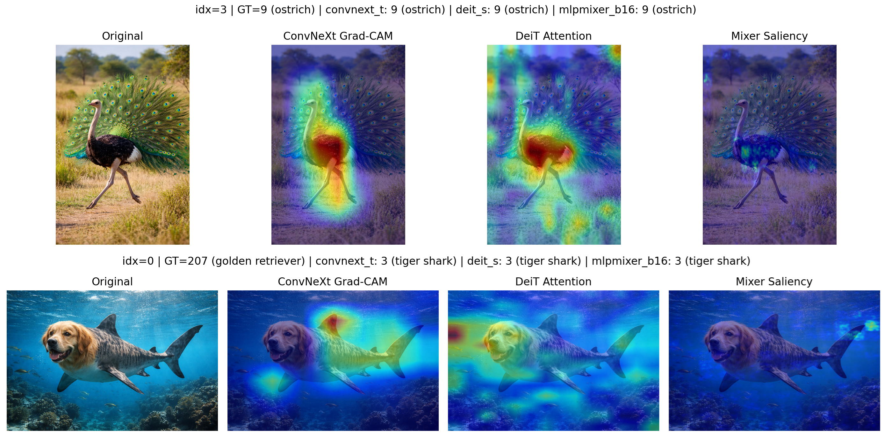
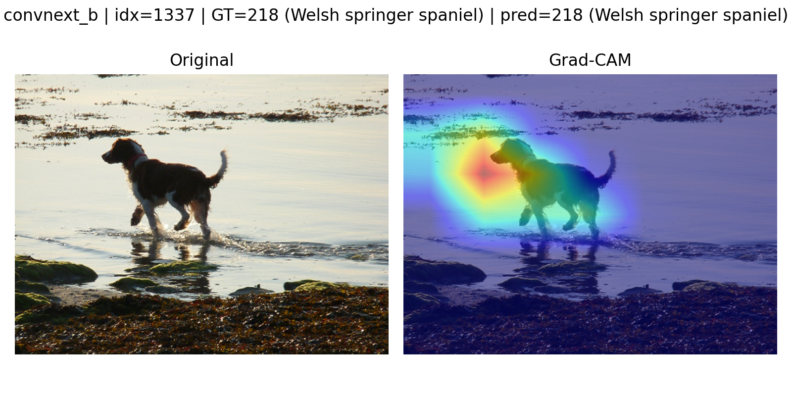
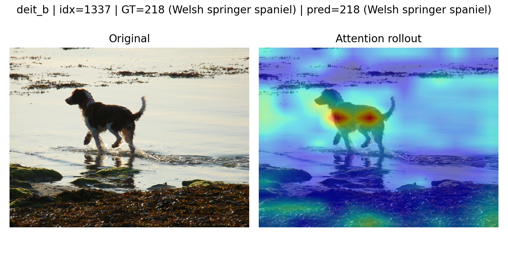
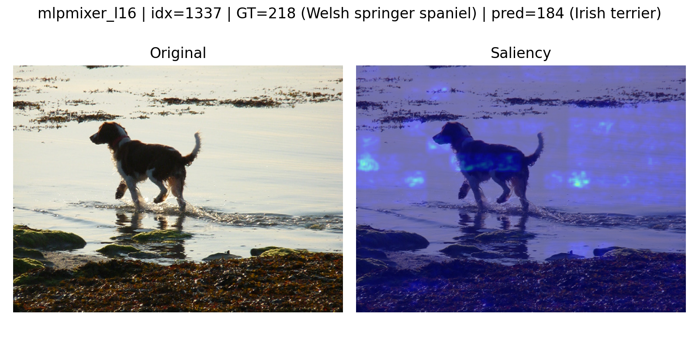

<p align="center">
  
</p>

# Vision Models Visualization

The goal in this repo is to visualize how different image classification architectures interpret images and make predictions.

We analyze CNN-based model (ConvNeXt), Transformer-based model (Deit), and MLP-based model (MLP-Mixer) and visualize how these models "think", with the help of Grad-CAM, Attention Rollout, Last-Layer Attention, and Saliency algorithms.

| Model      | Method                                            |
| ---------- | ------------------------------------------------- |
| ConvNeXt   | Grad-CAM, Saliency                                |
| DeiT / ViT | Attention Rollout, Last-Layer Attention, Saliency |
| MLP-Mixer  | Saliency                                          |

The framework works on **ImageNet** and **custom ImageFolder** datasets, and includes tools for model inference, analysis, and side-by-side comparison figures.

---

## Quickstart

1. Clone repo and install requirements.

```
git clone https://github.com/ztsv-av/vision_models_visualization
cd vision_models_visualization
pip install -r requirements.txt
```

2. Run inference:

```
python -m experiments.run_inference --model-id convnext_t deit_s mlpmixer_b16 --dataset-name imagefolder --dataset-root ./data/imagefolder
```

3. Run analysis (metrics):

```
python -m experiments.run_analysis --results results/imagefolder_test_convnext_t.npz results/imagefolder_test_deit_s.npz results/imagefolder_test_mlpmixer_b16.npz
```

4. Visualize comparison:

```
python -m experiments.run_visualization_comparison --dataset-name imagefolder --dataset-root ./data/imagefolder --analysis-path results/analysis_imagefolder_test_convnext_t+imagefolder_test_deit_s+imagefolder_test_mlpmixer_b16.json --case mixed --num-samples 4 --device cuda --vit-attn-method rollout --mixer-method saliency
```

## Visualization Analysis

### Why ConvNeXt produces localized blobs

ConvNeXt is convolutional. Grad-CAM targets the last conv feature map $\to$ extremely stable, smooth, and object-aligned heatmaps. ConvNeXt retains strong spatial priors, so its Grad-CAM maps reflect clear object boundaries.

<p align="center">
  
</p>

### Why DeiT attention looks scattered

ViT/DeiT operate on _patch tokens_, not pixels:

- Attention is global $\to$ focuses on mixed patterns
- Last-layer attention gives localized blobs
- Rollout integrates information from all layers $\to$ often diffuse
- Not as spatially coherent as convolutional models

In DeiT visualizations we see how it "pays attention" to the most of the pixels, unlike in ConvNeXt. Attention maps highlight where information flows in the transformer at the patch token level, not necessarily where the model 'looks' in the human sense.

<p align="center">
  
</p>

### Why MLP-Mixer saliency is weak

MLP-Mixer has:

- No convolution
- No attention heads
- No spatial kernels

Token mixing + channel mixing $\to$ gradients spread evenly $\to$ low-contrast, noisy saliency maps. Due to lack of attention or convolution, mixers often diffuse gradients across many tokens, producing noisy saliency maps. This is a known limitation of raw gradient explanations for Mixer-like models.

<p align="center">
  
</p>

## Dataset Preparation

### ImageNetV2

Source: https://huggingface.co/datasets/vaishaal/ImageNetV2/tree/main

Download any dataset (e.g. `imagenetv2-matched-frequency.tar.gz`) and extract it under `data/` folder.

### Custom ImageFolder

For custom ImageFolder images, the structure should be as follows (see `data/imagefolder/` for an example):

- Folder name = integer class ID from `data/imagenet_class_info.json`
- It represents the ImageNet-1K class index (0–999).
- You can check the ID and human label in `imagenet_class_info.json`.
  - Images inside the folder = any picture name.

The code will automatically map: PyTorch label $\to$ folder index $\to$ integer class ID (your folder name).

## Running Code

### Available Models (via timm)

See `models/models.py` `_MODEL_REGISTRY` and `ModelSpec` to add new model, e.g.:

```
ModelSpec(id="my_model", timm_name="...", pretrained=True)
```

#### ConvNeXt

- convnext_tiny
- convnext_small
- convnext_base
- convnext_large

#### DeiT

- deit_tiny_patch16_224
- deit_small_patch16_224
- deit_base_patch16_224

#### MLP-Mixer

- mlp_mixer_b16_224
- mlp_mixer_l16_224

### Common Parameters

- `--dataset-name` $\in$ `[imagenetv2, imagefolder]`
- `--dataset-root` $\in$ `[./data/imagenetv2, ./data/imagefolder]`

### Visualizations

#### Parameters

- `--vit-attn-method` $\in$ `[rollout, last_layer]`
- `--mixer-method` $\in$ `[saliency]`

#### All Models

##### Parameters

- `--case` $\in$ `[mixed, all_correct, all_wrong]`

##### Example

```
python -m experiments.run_visualization_comparison --dataset-name imagefolder --dataset-root ./data/imagefolder --analysis-path results/analysis_imagefolder_test_convnext_t+imagefolder_test_deit_s+imagefolder_test_mlpmixer_b16.json --case mixed --num-samples 4 --device cuda --vit-attn-method rollout --mixer-method saliency
```

#### Single Model

##### Example

```
python -m experiments.run_visualization --model-id convnext_t --dataset-name imagefolder --dataset-root ./data/imagefolder --index 2 --device cuda --vit-attn-method rollout --mixer-method saliency
```

### Inference

#### Example

```
python -m experiments.run_inference --model-id deit_s convnext_t mlpmixer_b16 --dataset-name imagefolder --dataset-root ./data/imagefolder
```

### Analysis (Compute Metrics)

#### Example

```
python -m experiments.run_analysis --results results/imagefolder_test_convnext_t.npz results/imagefolder_test_deit_s.npz results/imagefolder_test_mlpmixer_b16.npz
```

## Features

### Supported architectures

- **ConvNeXt** (tiny, small, base, large)
- **DeiT** (tiny, small, base)
- **MLP-Mixer** (b16, l16)

### Visualizations

- **Grad-CAM** (ConvNeXt only)
- **Attention Rollout** (ViT/DeiT)
- **Last-layer Attention** (ViT/DeiT)
- **Saliency Maps** (ConvNeXt, DeiT, MLP-Mixer)

### Datasets

- **ImageNetV2 (matched-frequency)**
- **Custom ImageFolder dataset**

## Citation

Original model papers:

- ConvNeXt (Liu et al., 2022)
- DeiT (Touvron et al., 2020)
- MLP-Mixer (Tolstikhin et al., 2021)
